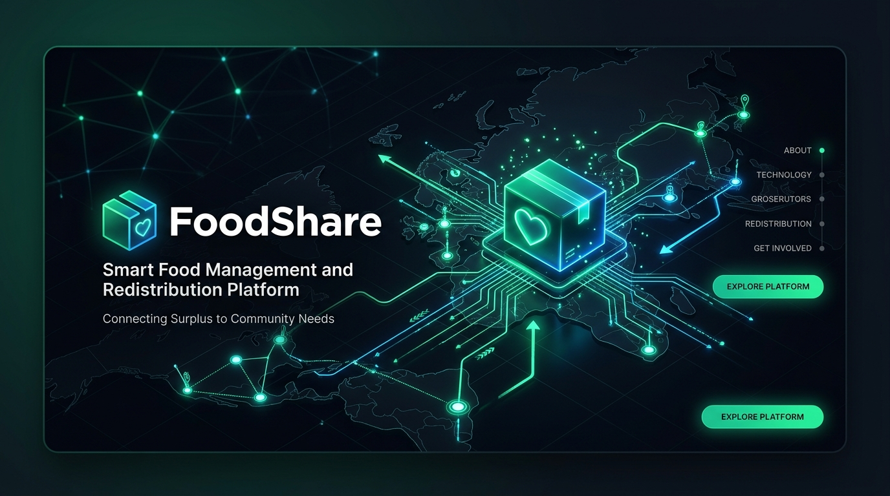
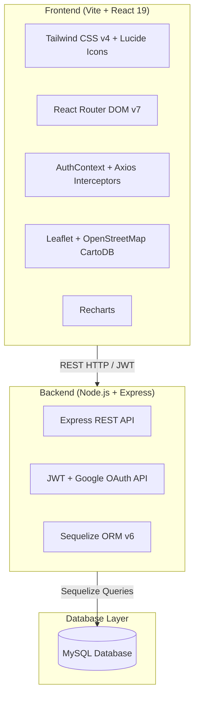
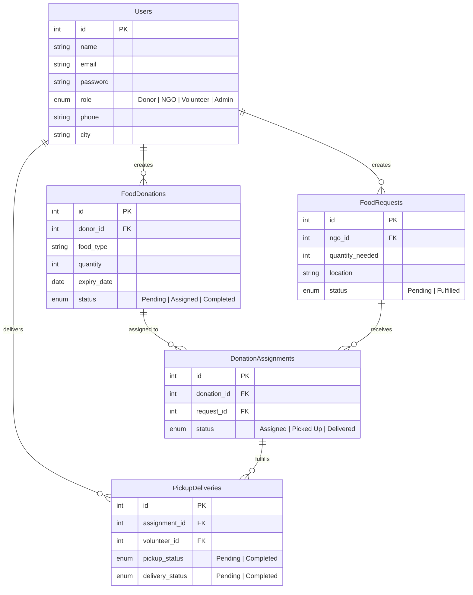

<div align="center">



# 🍲 FoodShare — Intelligent Food Management & Redistribution Platform

<p align="center">
  <b>Bridging the gap between food surplus and hunger through intelligent matching, live geo-mapping, and volunteer transit tracking.</b>
</p>

<p align="center">
  <a href="https://food-management-iota-lilac.vercel.app/" target="_blank">
    
  </a>
</p>

[](https://nodejs.org/)
[](https://reactjs.org/)
[](https://vitejs.dev/)
[](https://tailwindcss.com/)
[](https://expressjs.com/)
[](https://sequelize.org/)
[](https://leafletjs.com/)
[](#)

---

</div>

## 🌟 Overview

**FoodShare** is a full-stack, enterprise-grade food redistribution platform designed to combat food waste and alleviate hunger in accordance with the UN Sustainable Development Goal 2 (**Zero Hunger**).

The system seamlessly connects four key stakeholders:
1. **Donors** (Restaurants, caterers, households) donating surplus food.
2. **NGOs & Food Banks** requesting rations and cooked meals for communities in need.
3. **Volunteers** executing real-world pickups, deliveries, and transit updates.
4. **Admins** overseeing operations, matching surplus to demand, analyzing metrics, and managing users.

---

## ✨ Key Features

### 🍲 1. Donor Portal
- **Surplus Food Donation**: Register food donations with food type, quantity, expiry timeframe, and pickup location.
- **End-to-End Tracking**: Real-time status updates (`Pending`, `Assigned`, `Completed`).
- **Assigned Recipient Visibility**: Instant insight into which NGO claimed the donation, complete with NGO name, city, contact number, assigned volunteer, route distance, and transit time estimate.
- **Manage Listings**: Edit or cancel pending donations on the fly.

### 🏢 2. NGO & Food Bank Portal
- **Food Demand Requests**: Submit urgent food requests specifying required quantity and delivery location.
- **Smart Matching**: Automatically discover nearby food donations matching quantity requirements.
- **Assignment Pipeline**: View assigned donation streams, volunteer pickup status, and expected delivery windows.

### 🚚 3. Volunteer Transit Network
- **Live Pickup Feed**: Browse available food donations awaiting transit across nearby cities.
- **Distance & Travel Estimator**: Accurate distance calculations in kilometers and estimated transit times calculated using the Haversine formula.
- **1-Click Delivery Flow**: Transition tasks from `Pending Pickup` $\rightarrow$ `In Transit` $\rightarrow$ `Delivered` with live backend synchronization.

### 🛡️ 4. Admin Command Center
- **Matchmaking Engine**: Manually or automatically pair donor surplus with open NGO requests.
- **Interactive Food Map HUD**: Visual overview of national food distribution hubs, transit lines, and city density.
- **User Directory & RBAC**: View all system users, promote/demote roles (`Admin`, `Donor`, `NGO`, `Volunteer`), and manage accounts.
- **Platform Analytics**: Key performance indicators including total meals rescued, active deliveries, fulfilled requests, and platform growth.

### 🗺️ 5. Interactive Geographic Map
- **Voyager Map Layer**: Clean, high-contrast Leaflet map optimized for pan-India and global geo-coordinates.
- **Smart City Fallback Matrix**: Coordinates resolved for major Indian metros, state capitals, and tier-2 hubs.
- **Dynamic Layer Toggles**: Filter by Donors (Green pulse pins), NGOs (Blue pins), and Transit Routes (Dashed transit vectors).
- **City Focus Selector**: Instant zoom and focus on specific urban centers.

### 🔐 6. Robust Authentication & Security
- **Dual Authentication**: Traditional Email/Password with BCrypt hashing + One-Tap **Google OAuth 2.0**.
- **JWT Protection**: Secure HTTP authorization tokens with role-based access control (RBAC).
- **First-Time Admin Setup**: Automatic discovery and promotion for initial platform provisioning.

---

## 🛠️ Technology Stack



| Domain | Technology | Description |
|---|---|---|
| **Frontend Framework** | React 19 + Vite | High-performance, reactive single-page architecture |
| **Styling & Icons** | Tailwind CSS v4 + Lucide React | Modern dark-mode UI with emerald glassmorphic accents |
| **Mapping & Geospatial** | Leaflet + OpenStreetMap | Interactive GIS map with custom HTML pins & SVG routes |
| **State & API Client** | Axios + Context API | Global state management with JWT auto-injection & interceptors |
| **Backend Runtime** | Node.js + Express.js | Robust, modular RESTful microservice backend |
| **Database & ORM** | MySQL + Sequelize | Relational data persistence with foreign keys & cascading constraints |
| **Authentication** | JWT + Google Auth Library | Secure token-based session management |
| **Notifications** | React-Toastify | Non-intrusive, interactive action feedback |

---

## 🗄️ Database Architecture

The system uses a relational schema with 5 primary interconnected tables:



---

## 🚀 Quick Start Guide

### Prerequisites
- **Node.js**: v18.0.0 or higher
- **MySQL**: v8.0 or higher (or cloud MySQL instance such as Aiven, PlanetScale, Railway)
- **Git**

---

### 1. Clone the Repository
```bash
git clone https://github.com/Piyush160604/Food-Management.git
cd Food-Management
```

---

### 2. Backend Setup

1. **Install backend dependencies:**
   ```bash
   npm install
   ```

2. **Configure environment variables:**
   Create a `.env` file in the root directory:
   ```env
   PORT=5000
   DB_HOST=localhost
   DB_USER=root
   DB_PASSWORD=your_mysql_password
   DB_NAME=food_management_db
   DB_PORT=3306
   JWT_SECRET=your_super_secret_jwt_key_here
   GOOGLE_CLIENT_ID=your_google_oauth_client_id.apps.googleusercontent.com
   ```

3. **Start the backend server:**
   ```bash
   # Development mode with hot-reload
   npm run dev

   # Production mode
   npm start
   ```
   *The backend will automatically synchronize database models on startup.*

---

### 3. Frontend Setup

1. **Navigate to the frontend folder:**
   ```bash
   cd frontend
   ```

2. **Install frontend dependencies:**
   ```bash
   npm install
   ```

3. **Configure frontend environment variables:**
   Create a `frontend/.env` file:
   ```env
   VITE_API_URL=http://localhost:5000
   VITE_GOOGLE_CLIENT_ID=your_google_oauth_client_id.apps.googleusercontent.com
   ```

4. **Start the frontend development server:**
   ```bash
   npm run dev
   ```
   *Open [http://localhost:5173](http://localhost:5173) in your browser.*

---

## 📡 API Reference

### 🔐 Authentication (`/api/auth`)
| Method | Endpoint | Description | Auth Required |
|---|---|---|---|
| `POST` | `/api/auth/register` | Register new user (Donor/NGO/Volunteer) | No |
| `POST` | `/api/auth/login` | Login with email & password | No |
| `POST` | `/api/auth/google` | Authenticate with Google ID Token | No |
| `GET` | `/api/auth/admin-status`| Check if any admin account exists | No |

### 🍲 Donor Routes (`/api/donor`)
| Method | Endpoint | Description | Auth Required |
|---|---|---|---|
| `GET` | `/api/donor` | Fetch donor donations with assigned NGO & route info | `Donor` |
| `POST` | `/api/donor` | Create a new food surplus donation | `Donor` |
| `PUT` | `/api/donor/:id` | Update donation details | `Donor` |
| `DELETE` | `/api/donor/:id` | Delete a donation | `Donor` |

### 🏢 NGO Routes (`/api/ngo`)
| Method | Endpoint | Description | Auth Required |
|---|---|---|---|
| `GET` | `/api/ngo` | Fetch NGO food requests and assigned deliveries | `NGO` |
| `POST` | `/api/ngo` | Submit a new food demand request | `NGO` |
| `PUT` | `/api/ngo/:id` | Update request details | `NGO` |
| `DELETE` | `/api/ngo/:id` | Delete a request | `NGO` |

### 🚚 Volunteer Routes (`/api/volunteer`)
| Method | Endpoint | Description | Auth Required |
|---|---|---|---|
| `GET` | `/api/volunteer/pickups` | Fetch available pickups and assigned deliveries | `Volunteer` |
| `POST` | `/api/volunteer/status` | Update pickup/delivery transit status | `Volunteer` |

### 🛡️ Admin Routes (`/api/admin`)
| Method | Endpoint | Description | Auth Required |
|---|---|---|---|
| `GET` | `/api/admin/overview` | Platform-wide stats, all donations, requests, and map pins | `Admin` |
| `POST` | `/api/admin/match` | Manually match food donation to NGO request | `Admin` |
| `GET` | `/api/admin/users` | Fetch complete user directory | `Admin` |
| `PUT` | `/api/admin/users/:id/role`| Update user role (Promote / Demote) | `Admin` |
| `DELETE` | `/api/admin/users/:id` | Delete user account | `Admin` |

---

## 🌐 Production Deployment

### 1. Deploying the Backend (Railway / Render)
1. Push your repository to GitHub.
2. Link your repo to **Railway** or **Render**.
3. Set the Root Directory to `/` (default).
4. Set Build Command: `npm install` and Start Command: `npm start`.
5. Add all `.env` variables in your platform's dashboard.

### 2. Deploying the Frontend (Vercel / Netlify)
1. Link your repository to **Vercel** or **Netlify**.
2. Set Root Directory to `frontend`.
3. Set Build Command to `npm run build` and Output Directory to `dist`.
4. Add environment variable:
   - `VITE_API_URL`: Your deployed backend URL (e.g., `https://your-backend.up.railway.app`).

---

## 🤝 Contributing

Contributions make the open-source community thrive! Any contributions you make are **greatly appreciated**.

1. Fork the Project
2. Create your Feature Branch (`git checkout -b feature/AmazingFeature`)
3. Commit your Changes (`git commit -m 'feat: add some amazing feature'`)
4. Push to the Branch (`git push origin feature/AmazingFeature`)
5. Open a Pull Request

---

## 📜 License

Distributed under the **MIT License**. See `LICENSE` for more information.

<div align="center">
  <sub>Built with ❤️ to fight food waste and feed communities.</sub>
</div>
>>>>>>> 84873d8 (feat: add food management platform with backend routes, frontend dashboards, and geolocation utilities)
